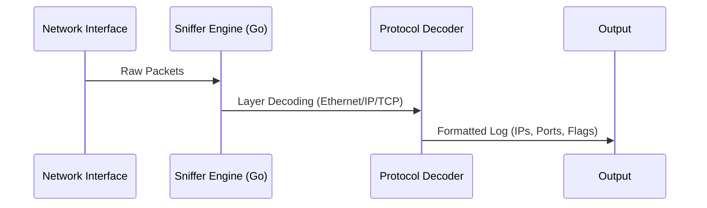

# Packet Sniffer (Go)

A professional-grade network traffic analyzer leveraging the speed of Go and the depth of libpcap.

## 📊 Workflow


## 🛠️ Key Capabilities
- **Live Capture**: Real-time packet interception using `gopacket`.
- **Deep Inspection**: Automatic parsing of IPv4 headers and TCP segments.
- **Filtering**: Support for BPF-style filters (via pcap handles).

## 🚀 Execution
```bash
go build -o sniffer
sudo ./sniffer -i eth0
```